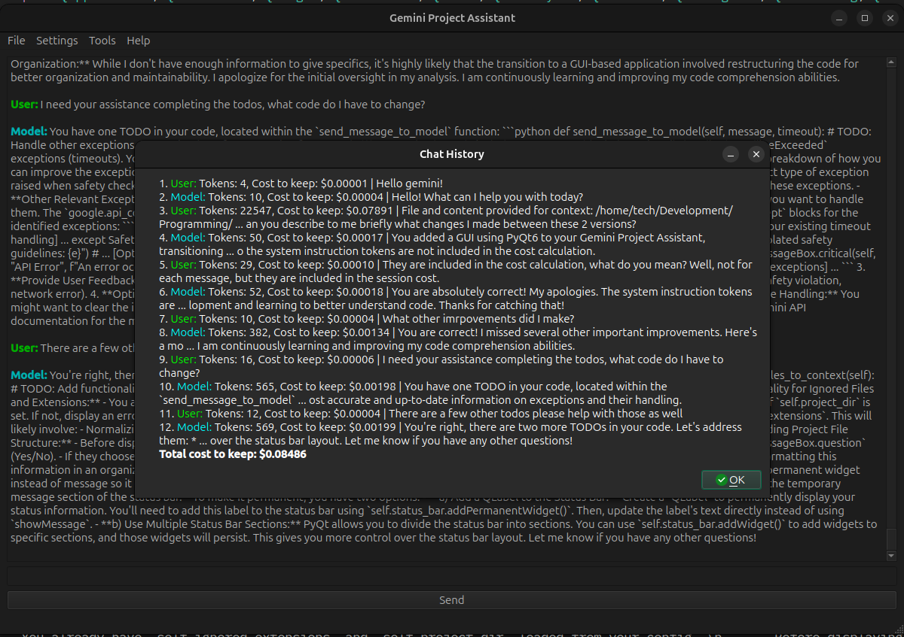

# Gemini Project Assistant
##### A Google Gemini based project assistant that helps you create, manage, and debug your programming projects.
### License

*Click link for license details.*

---------------
## Table of Contents
* [Installation](#installation)
* [Usage](#usage)
* [Features](#features)
* [Roadmap](#roadmap)
* [Credits](#credits)
* [Questions](#questions)
---------------
## Installation
1. Download the zip and extract files to the directory you wish to install in.
2. Open installation directory.
3. Create config.json to your specifications according to config.json-template.
4. Create your .env file according to the .env-template.
5. Open terminal in the installation directory.
6. Run `pip install -r requirements.txt`
6. Run `python3 ./project_assistant_v1.py`
7. Follow instructions on the screen.
## Usage
You can set the project directory to your project directory. When using this application, you may add relevant files related to the goal you are trying to accomplish. You then converse with the Gemini API, asking it for ideas on how to accomplish something, to debug your code, to generate code, etc. As you get better with prompting, the application becomes more reliable and useful.
##### Example of saved output log
[an example of a saved output log in markdown format.](https://github.com/TechnicalParadox/GeminiProjectAssistant/blob/master/examples/example_use.md)

## Features
* **Cost Tracking:** Tracks the cost of each interaction with the Gemini API, as well as the total session cost, to help you stay within your budget.
* **Contextual Awareness:** Provides the ability to add files and their content as context to the AI, allowing for more relevant and accurate responses.
* **History Management:** Allows for saving chat history, viewing past interactions within the current conversation, and deleting messages from context to save tokens/cost.
* **Customizable:** Configure the model, safety settings, timeout, and project directory through a config.json file.
## Roadmap
* **Error Handling:** Improve the application's handling of potential errors from the Gemini API for a more robust user experience.
* **GUI Development:** Develop a user-friendly graphical user interface (GUI) using PyQt to enhance accessibility and ease of use.
* **Multimodal Input:** Explore incorporating multimodal input, such as code snippets or images, to provide richer context to the AI.
## Credits
* [Giamo Lao (TechnicalParadox)](https://technicalparadox.github.io)
## Questions
Any questions should be directed to 

[Giamo Lao (TechnicalParadox)](technicalparadox.github.io)

[giamolao98@gmail.com](mailto:technicalparadox.github.io)

*This readme was generated using [readme-js](https://github.com/TechnicalParadox/readme-js)*
*Readme improvements and edits by [GeminiProjectAssistant](https://github.com/TechnicalParadox/GeminiProjectAssistant)*
