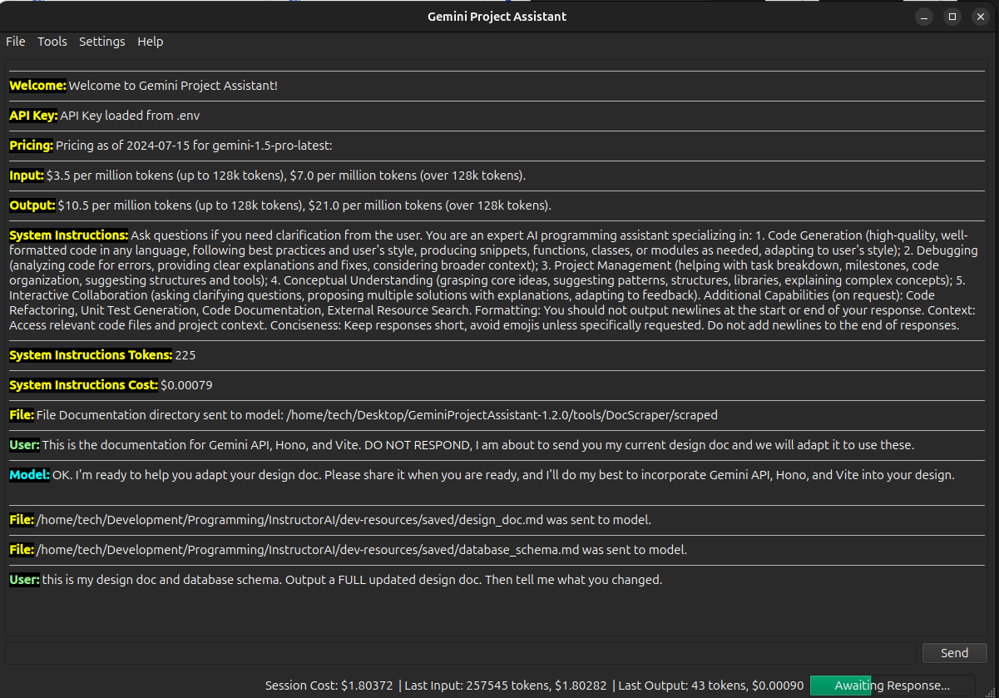

# Gemini Project Helper
##### A Google Gemini based project assistant that helps you create, manage, and debug your programming projects.
### License

*Click link for license details.*

---------------
## Table of Contents
* [Installation](#installation)
* [Usage](#usage)
* [Credits](#credits)
* [Questions](#questions)
---------------
## Installation
1. Download the zip and extract files to the directory you wish to install in.
2. Open installation directory.
3. Create your .env file according to the .env-template.
4. Edit config.json to your specifications.
5. Open terminal in the installation directory.
6. Run `pip install -r requirements.txt`
6. Run `python3 ./project_assistant_v1.py`
7. Follow instructions on the screen.
## Usage
You can set the project directory to your Godot project directory. When using this application, you may add relevant files related to the goal you are trying to accomplish. You then converse with the Gemini API, asking it for ideas on how to accomplish something, to debug your code, to generate code, etc. As you get better with prompting, the application becomes more reliable and useful.

## Credits
[Giamo Lao (TechnicalParadox)](technicalparadox.github.io)
## Questions
Any questions should be directed to 

[Giamo Lao (TechnicalParadox)](technicalparadox.github.io)

[giamolao98@gmail.com](mailto:technicalparadox.github.io)

*This readme was generated using [readme-js](https://github.com/TechnicalParadox/readme-js)*
